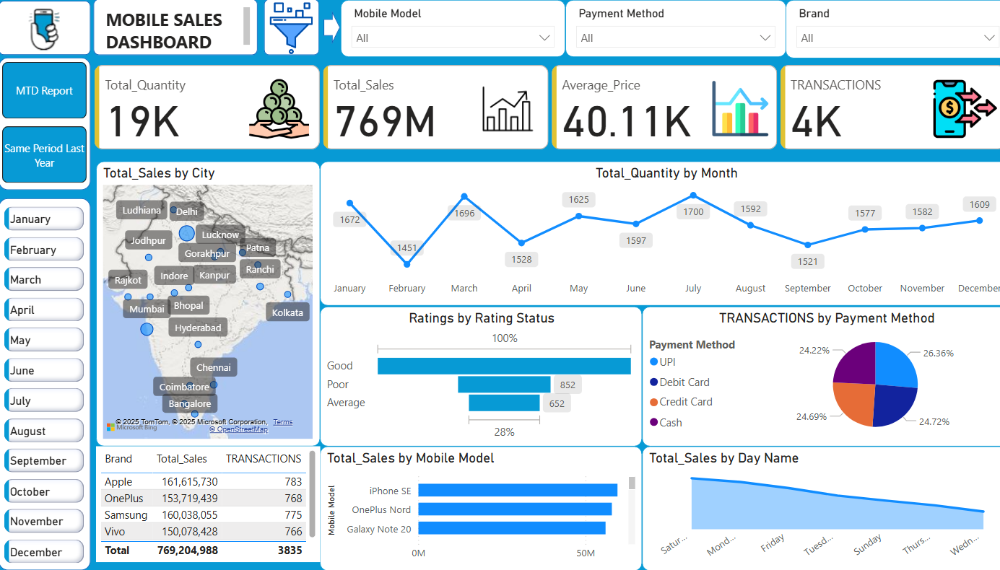

# Power BI Dashboard – Mobile Sales Analysis

## 📌 Overview  
This repository contains a **Power BI report (.pbix)** for analyzing **Mobile Sales Performance**. The dashboard provides interactive insights into total sales, transactions, ratings, payment methods, and regional performance. It helps businesses and stakeholders track sales trends, identify top-performing brands, and understand customer purchasing behavior.  

## 📊 Features  
- Interactive Power BI dashboard with dynamic slicers and filters  
- KPIs for **Total Quantity, Total Sales, Average Price, and Transactions**  
- Sales trends by **month, day, and region**  
- Map visualization of **city-wise sales distribution**  
- Brand-wise and model-wise performance tracking  
- Payment method analysis (UPI, Debit, Credit, Cash)  
- Customer ratings distribution (Good, Average, Poor)  

## 📂 Project Structure  
```
├── Power_BI Project.pbix   # Power BI report file
├── README.md                                   # Project documentation
├── dashboard_preview.png                        # Dashboard screenshot
```

## 🚀 How to Use  
1. Download and install **[Power BI Desktop](https://powerbi.microsoft.com/desktop/)** (free).  
2. Clone or download this repository.  
3. Open the `.pbix` file using Power BI Desktop.  
4. Explore the dashboard by interacting with filters, slicers, and visualizations.  

## 🌐 Live Dashboard  
You can also view the interactive report directly online:  
👉 [View Mobile Sales Dashboard](https://app.powerbi.com/view?r=eyJrIjoiMmUxMGI4YzAtNzY3MS00MTViLTkyMDItOGZlMmU1NTk4NjZjIiwidCI6IjM0YmQ4YmVkLTJhYzEtNDFhZS05ZjA4LTRlMGEzZjExNzA2YyJ9)  

## 🛠️ Requirements  
- Power BI Desktop (latest version recommended)  
- Dataset (already embedded inside `.pbix`)  

## 📷 Dashboard Preview  
  

## 📈 Key Insights  
- **Total Sales:** 769M across 4K transactions  
- **Top Brands:** Apple, OnePlus, Samsung, Vivo  
- **Popular Models:** iPhone SE, OnePlus Nord, Galaxy Note 20  
- **Customer Ratings:** Majority rated purchases as *Good*  
- **Payment Methods:** Balanced distribution across UPI, Debit, Credit, and Cash (~25% each)  
- **Regional Sales:** Strong presence in cities like Mumbai, Delhi, Hyderabad, and Bangalore  

## 💡 Use Cases  
- Monitor monthly and yearly mobile sales performance  
- Compare **brand and model-wise contributions**  
- Analyze **regional demand** to optimize distribution  
- Understand **customer satisfaction and payment preferences**  

## ✍️ Author  
**Rahul**  
